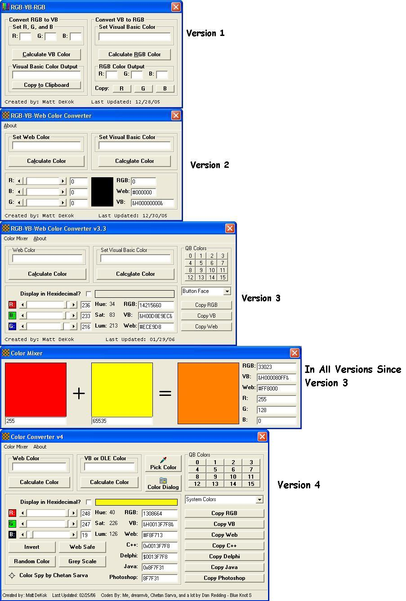



## Color Converter

### Description

This program can convert between Web color (#FF00C0), Visual Basic hexidecimal, and RGB.

Now on this version (4) I have included everything I could about colors on this site and added it to the program. If anything new in this version is incorrect then remember that it's not my fault.
 
### More Info
 

             |
---                |---
**Submitted On**   |2006-03-10 12:24:24
**By**             |[Matt DeKok](https://github.com/Planet-Source-Code/PSCIndex/blob/master/ByAuthor/matt-dekok.md)
**Level**          |Advanced
**User Rating**    |4.2 (42 globes from 10 users)
**Compatibility**  |VB 6\.0
**Category**       |[Graphics](https://github.com/Planet-Source-Code/PSCIndex/blob/master/ByCategory/graphics__1-46.md)
**World**          |[Visual Basic](https://github.com/Planet-Source-Code/PSCIndex/blob/master/ByWorld/visual-basic.md)
**Archive File**   |[Color\_Conv1979183102006\.zip](https://github.com/Planet-Source-Code/matt-dekok-color-converter__1-64303/archive/master.zip)

